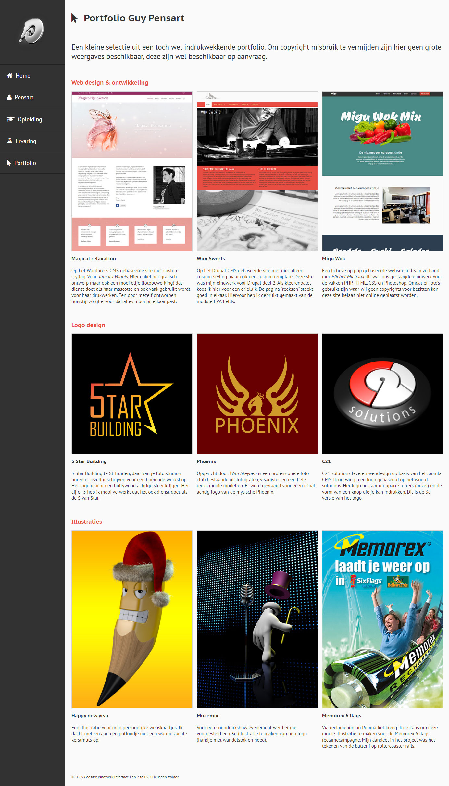

#InterFaceLab 2 portfolio project

##Description
This was my final project for the course interface lab 2 at CVO de verdieping.  
As long as my hosting volume allows some space for it  
Demo: http://cvo.guypensart.be/Eindwerk-IFL-bis/portfolio.html

##SCSS and Jade compiling
SCSS and jade compiling was done in phpStorm.

##Project rules
* Valid HTML & CSS
* Use of SVG
* Responsive and support for retina displays
* No dynamic pages, so no php allowed
* No javascript beside some allowed scripts
* No frameworks for styling like Boostrap or Foundation
* No BEM, its all about working with specific selectors for styling
* support for IE9 and up but also cross browser

##Used javascripts
* Modernizr.js - _support for old browsers and fallback for the SVG logo's in the portfolio_
* Prefixfree.js - _allowing me being lazy and not including a single prefix_
* Retina.js - _to provide high quality images for retina displays_
* jQuery.js - _No explanation needed_

##@ Copyright notice
The images, illustrations and vector logo's are copyrighted, Do not use them.